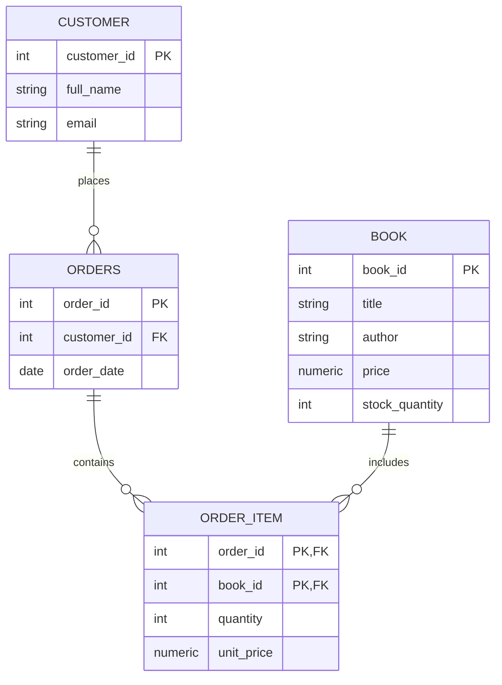

# Online Bookstore ER Diagram

```mermaid
erDiagram
    CUSTOMER ||--o{ ORDERS : places
    ORDERS ||--o{ ORDER_ITEM : contains
    BOOK ||--o{ ORDER_ITEM : includes

    CUSTOMER {
        int customer_id PK
        string full_name
        string email
    }

    BOOK {
        int book_id PK
        string title
        string author
        numeric price
        int stock_quantity
    }

    ORDERS {
        int order_id PK
        int customer_id FK
        date order_date
    }

    ORDER_ITEM {
        int order_id PK,FK
        int book_id PK,FK
        int quantity
        numeric unit_price
    }
```
